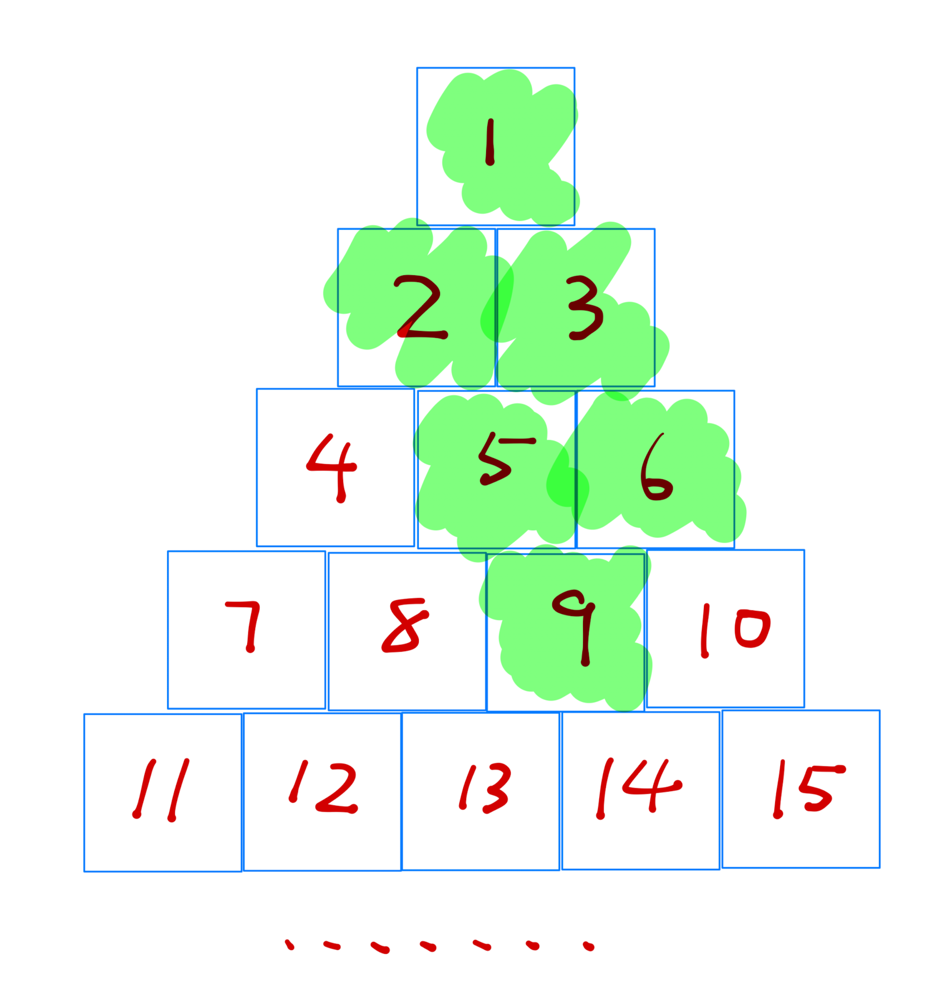

# Challenge 173: Tower

**Difficulty: 3/10  
Labels: Binary Search or Prefix Sum or Dynamic Programming or Data Structures**

Consider the attached image.

A tower is constructed such that row k has k boxes, and all boxes are aligned to the center. Number the boxes from top-to-bottom, then left-to-right. Call this the **label** of the box. Tim is testing out his water gun. When Tim knocks out a box, it falls, then all boxes directly above it falls, and all boxes directly above those falls, until box 1 falls. For example, if Tim hits box 9, the highlighted boxes would fall.

Tim hits box `n`. Compute the sum of the labels of all boxes that will fall. In the image, it is `9+5+6+2+3+1 = 26`.

## Task

You are given a number `T` and `T` test cases follow, for each test case:

- The first line contains an integer `n`.

Output a single integer, the sum of the labels of all boxes that will fall, including `n`, if box `n` is hit.

### Examples

#### Input

```rust
10
9
1
2
3
4
13
15
100
2023
654321
```

#### Output

```rust
26
1
3
4
7
51
35
1845
267148
62286323750
```

### Note

- `1 <= T`
- `1 <= n <= 10`<sup>`6`</sup>

### Submissions

Code can be written in any of these languages:

- `Python` 3.10
- `C` (gnu17) / `C++` (c++20) - GCC 11.2
- `Ruby` 3.1
- `Golang` 1.19
- `Java` 19 (Open JDK) - use **"class Main"!!!**
- `Rust` 1.68.2
- `C#` 10 (.Net 6.0)
- `JavaScript` ES2022 (Node.js 18.10)

To download tester for this challenge click [here](https://downgit.github.io/#/home?url=https://github.com/Pomroka/Previous_Challenges/tree/main/Challenge_173)
