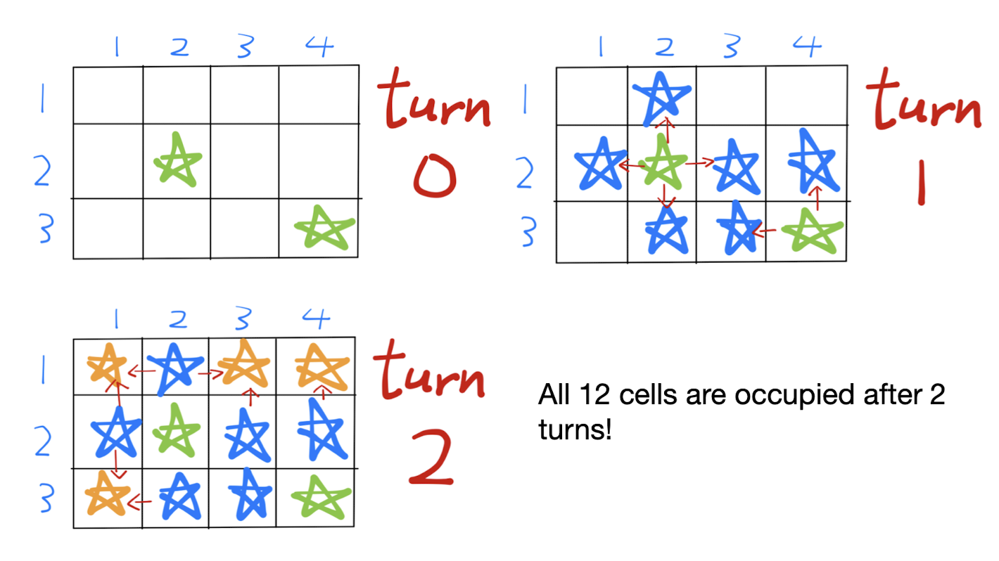

# Challenge 209: Expansion

**Difficulty: 5/10  
Labels: Graphs**

SnowballSH is playing a video game where his goal is to expand his fictional empire's influence to cover the entirety of a rectangular map.

The map is represented by a grid of `n` rows and `m` columns. The rows are labeled `1, 2, ..., n` and the columns are labeled `1, 2, ..., m`.

SnowballSH initially has `k` settlers on this map. In the beginning of the game (turn 0), his empire only occupies the `k` cells occupied by the `k` settlers. During each turn, all unoccupied cells that share an edge with at least one previously occupied cell become occupied.

SnowballSH wins the game immediately after a turn if his fictional empire occupies all `n * m` cells on the map. How many turns will SnowballSH need to take before he wins?

## Task

You are given a number `T` and `T` test cases follow, for each test case:

- The first line contains three integers, `n`, `m`, and `k` - the number of rows, the number of columns, and the number of initial settlers.
- The next `k` lines each contain two integers `r` and `c`, meaning a settler initially spawns at the location `(r, c)` on the map.

Output a single integer, the minimum number of turns needed for all `n * m` cells to become occupied.

### Examples

#### Input

```rust
3
3 4 2
2 2
3 4
2 3 6
1 1
1 2
1 3
2 1
2 2
2 3
20 24 4
10 8
14 20
20 21
3 1
```

#### Output

```rust
2
0
17
```

- For the first test case, see the image.
    
- For the second test case, all 6 squares are initially occupied.

### Note

- `1 <= T`
- `1 <= n, m <= 10`<sup>`4`</sup>
- `1 <= k <= n * m <= 10`<sup>`4`</sup>
- All `(r, c)` are distinct (no two settlers initially occupy the same cell).

### Submissions

Code can be written in any of these languages:

- `Python` 3.11
- `C` (gnu17) / `C++` (c++20) - GCC 12.2
- `Ruby` 3.3.4
- `Golang` 1.21
- `Java` 19 (Open JDK) - use **"class Main"!!!**
- `Rust` 1.72
- `C#` 11 (.Net 7.0)
- `JavaScript` ES2023 (Node.js 20.6)
- `Zig` 0.13.0

To download tester for this challenge click [here](https://downgit.github.io/#/home?url=https://github.com/Pomroka/PreviousChallenges/tree/main/Challenge_209)
